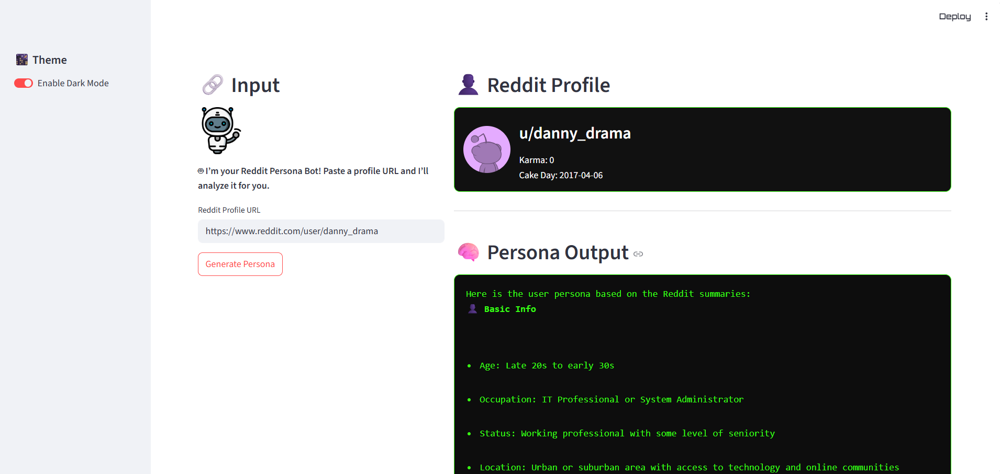
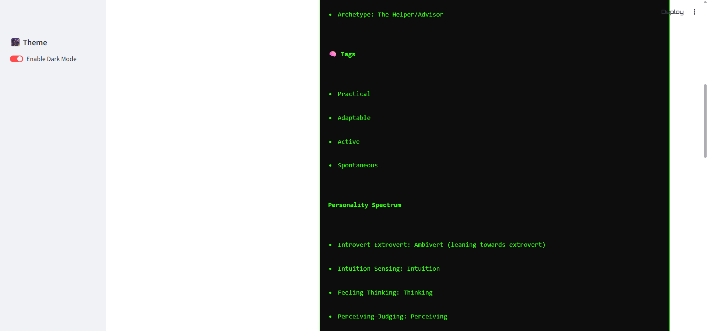
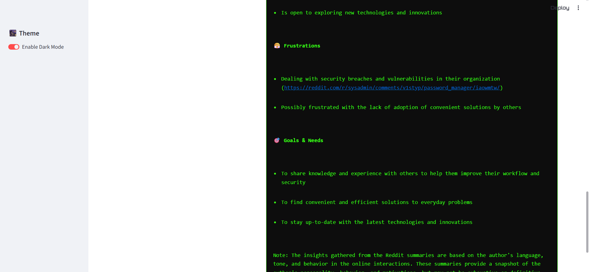

# 🧠 Reddit Persona Generator using LLM

A Streamlit-powered tool that generates a detailed persona from any Reddit profile URL using Groq's LLaMA3-70B language model.

---

## 📌 Overview

This application scrapes Reddit user activity (posts and comments), summarizes it using an LLM, and presents a structured persona including motivations, behavior, tags, and frustrations.

---

## 🛠️ Tech Stack

- Python 3.10+
- Streamlit
- PRAW (Python Reddit API Wrapper)
- Groq (LLaMA3-70B)
- dotenv

---

## 🚀 Features

- Analyze Reddit profiles via URL
- Summarize posts and comments into behavior insights
- Generate a complete persona profile
- Dark mode UI toggle
- Download persona as `.txt`

---

## 🖼️ App Screenshots

### 🔵 1



### 🟢 2



### ⚙️ 3



---

## ⚙️ Setup Instructions

### 1. Clone the Repository

```bash
git clone https://github.com/samruddhi2003/Persona_generate_using_redditURL.git
cd Persona_generate_using_redditURL
```

### 2. Create Virtual Environment

```bash
python -m venv .venv
.\.venv\Scripts\activate    # Windows
# or
source .venv/bin/activate  # macOS/Linux
```

### 3. Install Dependencies

```bash
pip install -r requirements.txt
```

### 4. Create a `.env` file in the root directory

```env
REDDIT_CLIENT_ID=your_reddit_client_id
REDDIT_CLIENT_SECRET=your_reddit_client_secret
REDDIT_USER_AGENT=reddit_persona_app
GROQ_API_KEY=your_groq_api_key
```

---

## ▶️ Run the App

```bash
streamlit run app.py
```

The app will open in your browser at `http://localhost:8501`.

---

## ⚠️ Known Issues

- Rate limits may occur from Groq; wait a few seconds and retry
- Empty persona output may indicate private or inactive user
- Ensure `.env` file is properly configured

---

## 👩‍💻 Author

**Samruddhi Kulkarni**  
[LinkedIn](https://www.linkedin.com/in/samruddhi-kulkarni-010315227/)

---

## 📄 License

This project is licensed under the MIT License.
